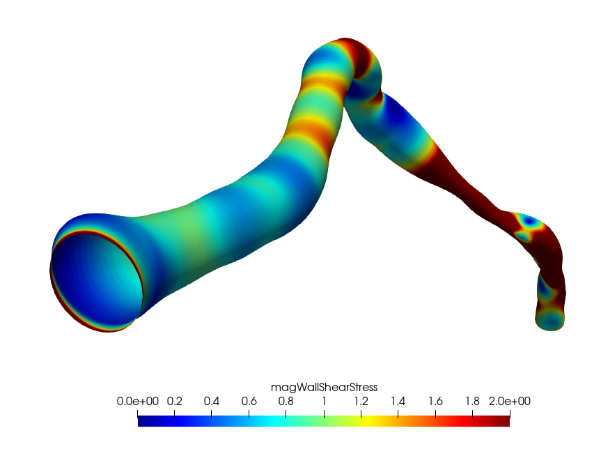
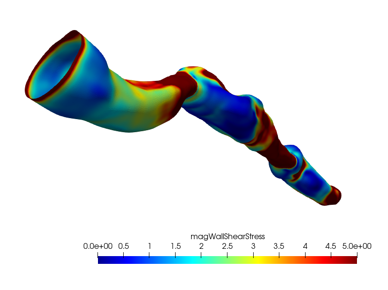
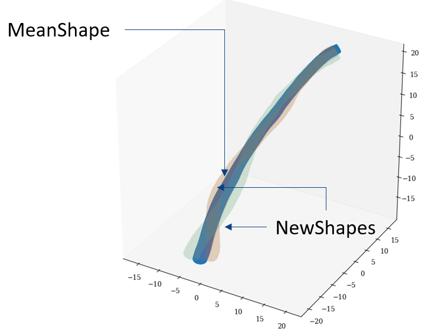
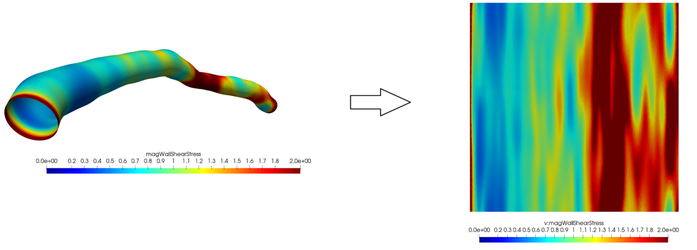

# pymethods

 A library for coronary artery reconstruction from angriography, OCT + angiography,
 statistical shape modelling, CFD mesh generation and surface unwrapping.

Angiography data has been extracted via QAngio XA 3D RE,
(Medis, Leiden, the Netherlands), whilst OCT data has been extracted via QIvus
(version 3.0, Medis Medical Imaging, Leiden, the Netherlands).

## Angiography Surface Generation

## Angiography + OCT Surface Generation

## Statistical Shape Modelling

## Surface Unwrapping


# Installation

to unwrap the cylindrical meshes the python bindings found in
`CGALUMethods <https://github.com/Chr1sC0de/CGALUnwrapper>`_ should be
importable. A version which works with python 3.7 is included. At
the moment CGALMethods does not work with python 3.8 and above.

````
from pymethods import CGALMethods as CM
````

To generate meshes for CFD the `pointwise <https://www.pointwise.com/>`_
must be installed.

to install requirements
````
python -m pip install -r requirements.txt
````

to install the modules in release mode

````
python -m pip install .
````
to install in symbolic mode

````
python -m pip install -e .
````

# Examples
in depth examples are located in the ./testsJupyter folder
